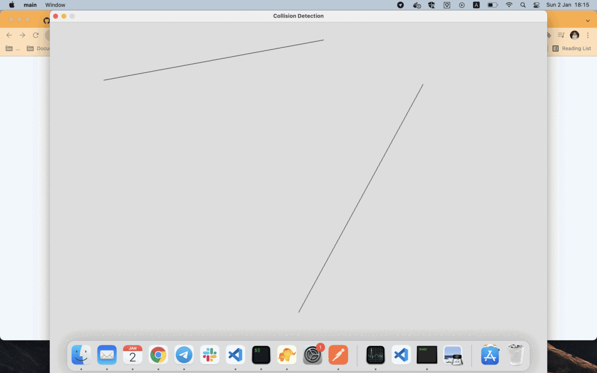

# Line intersection

## Quick start

- MSYS2

```bash
make
./main.exe
```

- MacOS

```bash
make macos
./main
```

## How it works

1. Line 1: `a1x + b1y = c1`
2. Line 2: `a2x + b2y = c2`
3. (Line 1 * b2): `a1b2x + b1b2y = c1b2` 
4. (Line 2 * b1): `a2b1x + b2b1y= c2b1` 
5. (3 - 4): `x = (c1b2 - c2b1)/(a1b2 - a2b1)`
6. (Line 1 * a2) = `a1a2x + b1a2y = c1a2`
7. (Line 2 * a1) = `a2a1x + b2a1y = c2a1`
8. (7 - 6): `y = (c2a1 - c1a2)/(a1b2 - a2b1)`

=> Line intersect at P(x0,y0) where x0 = `(c1b2 - c2b1)/(a1b2 - a2b1)` and y0 = `(c2a1 - c1a2)/(a1b2 - a2b1)`

- Note: If two line are parallel or collinear when `a1b2 - a2b1` equal `0`. 

