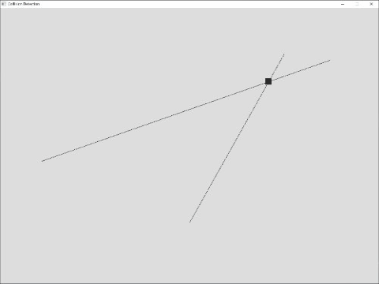
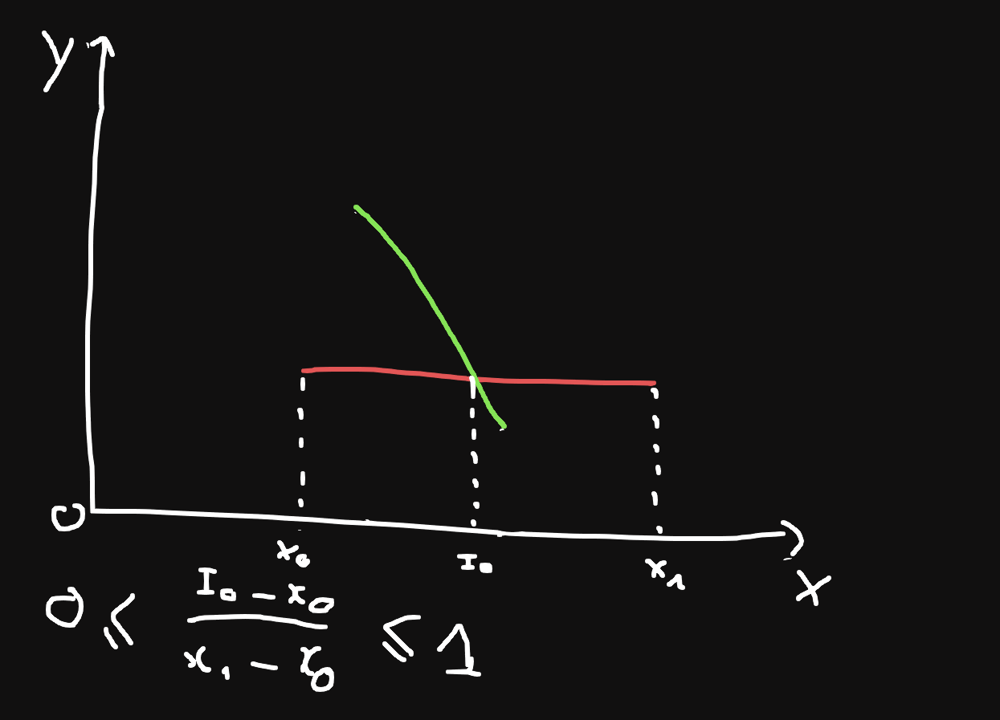

# Segment intersection

## Quick start

- MSYS2

```bash
make
./main.exe
```

- MacOS

```bash
make macos
./main
```



## How it works


We use a formula from [line intersections](https://github.com/thanhfphan/math-and-game/tree/master/collision_detection/line-intersections) to find the point where 2 line intersect(`I0`). And then calculate `ration = (I0 - x0)/(x1 - x0)` if ratio larger than 0 and less than 1 then its mean 2 segment intersect. Note we must calculate ratio for both `x` and `y`.