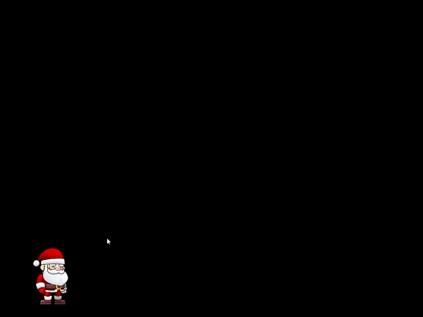
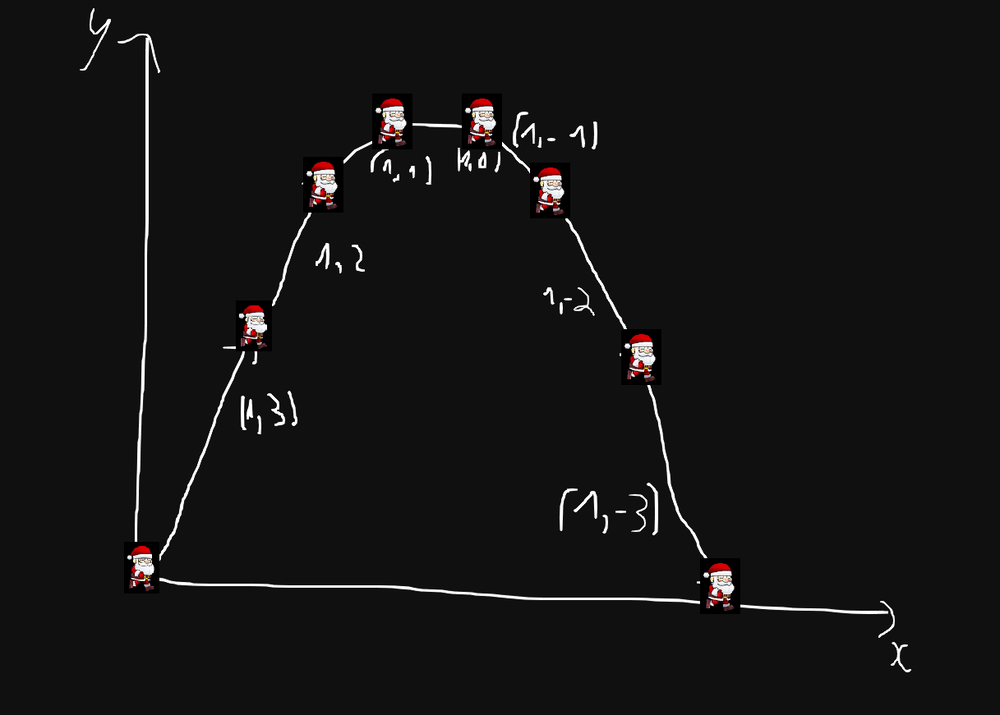

# Jumping and Gravity

Asset: https://www.gameart2d.com/santa-claus-free-sprites.html

## Quick start

- Windows(MSYS2)

```bash
pacman -S mingw-w64-x86_64-sfml
make winos
./main.exe
```

- MacOS

```bash
brew install sfml
make macos
./main
```



## How it works

Let say we have 2 vector `v = (1,3)` `g = (0,1)` and player's position at `P = (0,0)`. The new player's position can be calculated by formula below(add `P` with `v` then update `v` of `v`).

1. P = P + v
2. v = v + g


